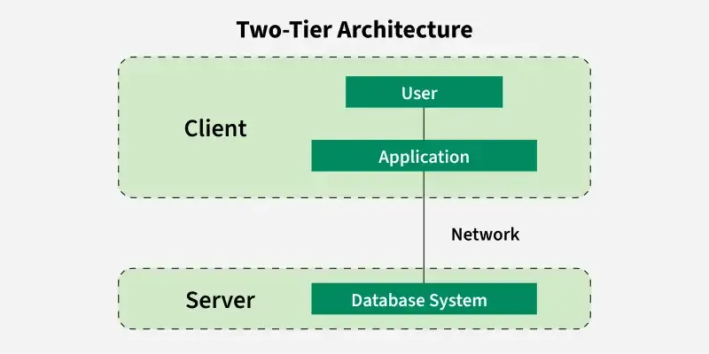

2-Tier Architecture (টু-টায়ার আর্কিটেকচার)

### বিস্তারিত (Overview)
টু-টায়ার হলো একটি ক্লায়েন্ট-সার্ভার আর্কিটেকচার। এখানে দুটি প্রধান স্তর থাকে: 
১. **Client Tier (Presentation & Business Logic):** সাধারণত ডেস্কটপ বা ফ্যাট ক্লায়েন্ট অ্যাপ্লিকেশন।
২. **Database Tier (Data Store):** ডাটাবেজ সার্ভার।

           
|    Client Tier     |  SQL/RDBMS |   Database Tier    |
| (UI + Biz Logic)   | ---------> |  (Oracle/MySQL)    |
            

### কেন ব্যবহার করবেন? (Why Use It)
* কোনো ইন্টেরমিডিয়েট ওয়েবলজিক সার্ভার ছাড়াই সরাসরি ডাটাবেজে ডাটা রিড-রাইট করার জন্য।

### কখন ব্যবহার করবেন? (When to Use It)
* ঐতিহ্যবাহী ইন-হাউস বা ডেস্কটপ ভিত্তিক ইন্টারনাল এন্টারপ্রাইজ ম্যানেজমেন্ট সফটওয়্যার (যেমন: পুরোনো হাসপাতালের বিলিং বা ব্যাংক ট্রানজেকশন সফটওয়্যার)।

### সুবিধা (Pros)
* **দ্রুত আর্কিটেকচার (Direct Access):** মাঝখানে বাড়তি কোনো নেটওয়ার্ক হপ (Network Hop) নেই।
* **গঠন সহজ:** ছোট স্কেলের ইন্টারনাল টুলের জন্য ডেভেলপমেন্ট তুলনামূলক সহজ।

### অসুবিধা (Cons)
* **নিরাপত্তাহীনতা (Security Risks):** ক্লায়েন্ট অ্যাপ্লিকেশনের কাছে সরাসরি ডাটাবেজের কানেকশন স্ট্রিং ও ক্রেডেনশিয়ালস থাকে।
* **দরিদ্র স্কেলেবিলিটি:** ডাটাবেজ কানেকশন লিমিটেশনের কারণে বিপুল সংখ্যক ইউজারে স্কেল করে না।
* **ক্লায়েন্ট মেইনটেন্যান্স:** ক্লায়েন্ট অ্যাপে আপডেট দিলে প্রতিটি ইউজারের কম্পিউটারে অ্যাপটি ম্যানুয়ালি আপডেট করতে হয়।

---

