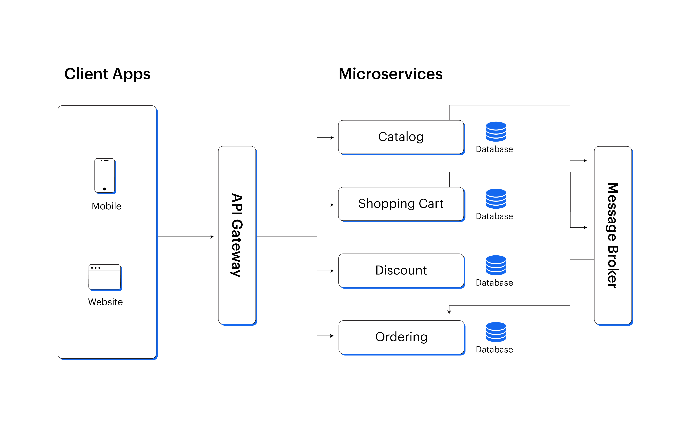

Microservices Architecture (মাইক্রোসার্ভিসেস আর্কিটেকচার)

### বিস্তারিত (Overview)
মাইক্রোসার্ভিস আর্কিটেকচারে একটি বিশাল অ্যাপ্লিকেশনকে অনেকগুলো ছোট ছোট, স্বাধীন এবং নির্দিষ্ট দায়িত্বপ্রাপ্ত (Loosely Coupled & Single Responsibility) সার্ভিসে বিভক্ত করা হয়। প্রতিটি সার্ভিস নিজের মতো আলাদা ডাটাবেজ মেনটেইন করে (Database-per-Service) এবং HTTP/REST, gRPC বা Message Broker-এর মাধ্যমে অন্যান্য সার্ভিসের সাথে কথা বলে।

     
|    User Service    |     |   Order Service    |
|   (Node.js/Go)     |     |    (Python/Java)   |
    
|                          |
v                          v
     
|   User Database    |     |   Order Database   |
     

### কেন ব্যবহার করবেন? (Why Use It)
* বিভিন্ন টিমকে সম্পূর্ণ স্বাধীনভাবে আলাদা ফিচার ডেভেলপ, টেস্ট এবং ডিপ্লয় করার স্বাধীনতা দিতে।

### কখন ব্যবহার করবেন? (When to Use It)
* বিশাল আকারের এন্টারপ্রাইজ অ্যাপ্লিকেশন এবং অনেক বড় অর্গানাইজেশনে (যেমন: Netflix, Uber)।
* যখন অ্যাপ্লিকেশনের বিভিন্ন অংশের স্কেলিং রিকোয়ারমেন্ট সম্পূর্ণ আলাদা (যেমন: পেমেন্ট মডিউলের চেয়ে সার্চ মডিউলে ১০X ট্রাফিক)।

### সুবিধা (Pros)
* **স্বাধীন ডিপ্লয়মেন্ট ও স্কেলিং (Independent Scaling):** শুধু যে সার্ভিসে লোড বেশি, সেটি স্কেল করা যায়।
* **টেকনোলজি ফ্রিডম (Polyglot):** প্রতিটি সার্ভিস আলাদা ল্যাঙ্গুয়েজে (যেমন: একটি Go-তে, অন্যটি Python-এ) লেখা সম্ভব।
* **হাই ফল্ট টলারেন্স (Fault Isolation):** একটি সার্ভিস ডাউন হলেও পুরো অ্যাপ অচল হয় না।

### অসুবিধা (Cons)
* **উচ্চ মেলাবেন ও অবকাঠামোগত জটিলতা (Operational Complexity):** সার্ভিস মনিটরিং, সার্ভিস ডিসকভারি, লোড ব্যালেন্সিং এবং ট্র্যাকিং কঠিন।
* **ডিস্ট্রিবিউটেড ডাটা ম্যানেজমেন্ট:** ডিস্ট্রিবিউটেড ট্রানজেকশন (Saga Pattern) এবং ডাটা কনসিস্টেন্সি বজায় রাখা অত্যন্ত জটিল।
* **নেটওয়ার্ক ল্যাটেন্সি (Network Overhead):** নেটওয়ার্ক কলের কারণে ওভারহেড বাড়ে।

---

