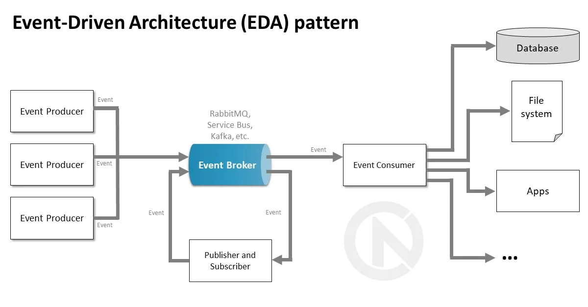

Event-Driven Architecture (ইভেন্ট-ড্রিভেন আর্কিটেকচার - EDA)

### বিস্তারিত (Overview)
ইভেন্ট-ড্রিভেন আর্কিটেকচারে উপাদানগুলো সরাসরি একে অপরকে কল করে না। কোনো কাজ সম্পন্ন হলে একটি **"Event"** (ঘটনা) পাবলিশ করা হয় (Event Producer)। **Event Broker** (যেমন: Apache Kafka, RabbitMQ) সেই ইভেন্টটি রিসিভ করে এবং যেসব সার্ভিস সেটি শুনতে সাবস্ক্রাইব করেছে (Event Consumer), তারা অ্যাসিনক্রোনাসভাবে (Asynchronously) কাজ সম্পন্ন করে।

[Producer: Order Service]
|
Publishes "OrderPlaced" Event
v

|  Message Broker (Kafka/Rabbit) |

/

Consume               Consume
v                   v
[Consumer: Payment]    [Consumer: Inventory]

### কেন ব্যবহার করবেন? (Why Use It)
* সিস্টেমকে ডিকাপল্ড (Decoupled) করতে এবং অ্যাসিনক্রোনাস ও রিয়েল-টাইম প্রসেসিং নিশ্চিত করতে।

### কখন ব্যবহার করবেন? (When to Use It)
* রিয়েল-টাইম ডেটা প্রসেসিং, নোটিফিকেশন সিস্টেম, ই-কমার্স অর্ডারিং প্লেসমেন্ট, ফিনটেক বা IoT সিস্টেম।

### সুবিধা (Pros)
* **চরম ডিকাপলিং (Extreme Decoupling):** প্রডিউসার জানেই না কে ইভেন্টটি কনসিউম করছে। নতুন কনসিউমার যোগ করা খুব সহজ।
* **হাই পারফরম্যান্স ও হাই থ্রুপুট:** রিকোয়েস্টের রেসপন্সের জন্য অপেক্ষা না করে দ্রুত প্রসেস সম্পন্ন হয় (Non-blocking)。

### অসুবিধা (Cons)
* **ইভেনচুয়াল কনসিস্টেন্সি (Eventual Consistency):** ডেটা সাথে সাথে সব জায়গায় সিঙ্ক নাও হতে পারে।
* **ডিব্যাগিং কঠিন:** ইভেন্ট ফ্লো ট্র্যাক করা এবং সিস্টেমের স্টেট ডিব্যাগ করা জটিল।

---
