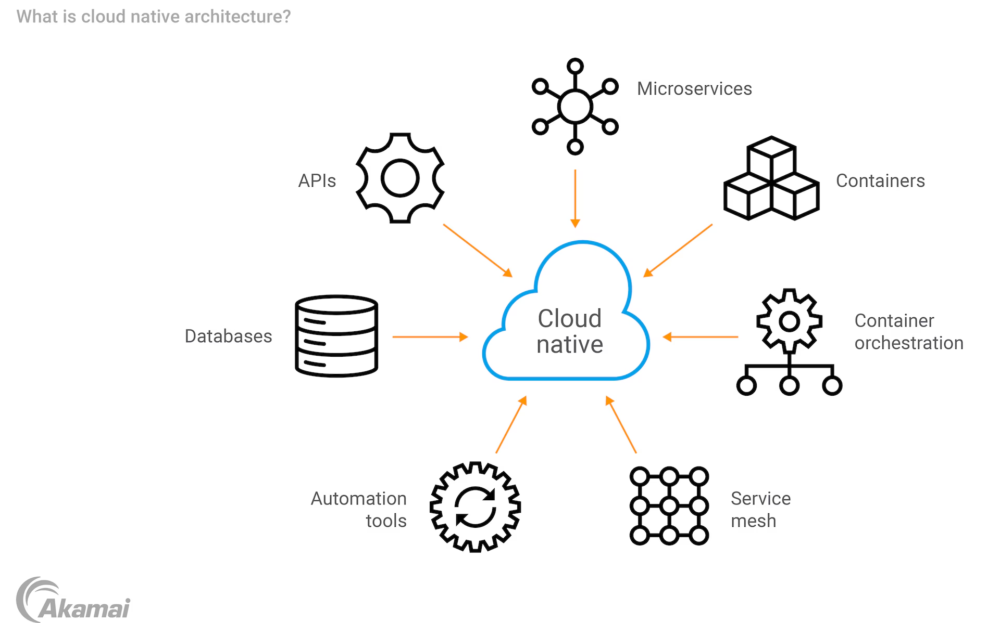

Cloud-Native Architecture (ক্লাউড-নেটিভ আর্কিটেকচার)

### বিস্তারিত (Overview)
ক্লাউড-নেটিভ এমন একটি পদ্ধতি যা অন-প্রেমিসেসের বদলে পুরোপুরি ক্লাউড এনভায়রনমেন্টের (AWS, GCP, Azure) শক্তি ব্যবহার করার জন্য বিশেষভাবে ডিজাইন করা হয়। এটি ৪টি প্রধান স্তম্ভের উপর দাঁড়িয়ে থাকে: **Containers (Docker), Orchestration (Kubernetes), Microservices, এবং CI/CD Automation**।

+-------------------------------------------------------------+
|                  CLOUD INFRASTRUCTURE                       |
|  +-------------------------------------------------------+  |
|  |              KUBERNETES CLUSTER (K8s)                 |  |
|  |  +---------------------+    +---------------------+   |  |
|  |  | Container (App Pod) |    | Container (App Pod) |   |  |
|  |  +---------------------+    +---------------------+   |  |
|  +-------------------------------------------------------+  |
|  Managed Database (RDS) | Managed Storage (S3)              |
+-------------------------------------------------------------+

### কেন ব্যবহার করবেন? (Why Use It)
* ক্লাউডের ইলাস্টিসিটি (Auto-scaling), হাই এভেলিবিলিটি এবং অটোমেশনের পূর্ণ সুবিধা নেওয়ার জন্য।

### কখন ব্যবহার করবেন? (When to Use It)
* আধুনিক যেকোনো স্কেলেবল প্রডাকশন অ্যাপের জন্য যা ক্লাউডে হোস্ট হতে যাচ্ছে।

### সুবিধা (Pros)
* **অটো-স্কেলিং (Auto-scaling):** ট্রাফিক বাড়লে ক্লাউড নিজেই নোড/পড বাড়িয়ে দেয়, ট্রাফিক কমলে কমিয়ে ফেলে।
* **পোর্টেবিলিটি (Portability):** কন্টেইনারাইজেশনের কারণে যেকোনো ক্লাউড প্রোভাইডারে নিরবচ্ছিন্নভাবে রান করা যায়।

### অসুবিধা (Cons)
* **ক্লাউড কস্ট ফেইলিয়ার:** কস্ট ম্যানেজমেন্ট ঠিকমত না করলে বিশাল ক্লাউড বিল আসতে পারে।
* **শেখার চড়া কার্ভ (Steep Learning Curve):** Docker, Kubernetes, Terraform এবং Cloud Architecture সিকিউরিটি জানা বাধ্যতামূলক।

---

