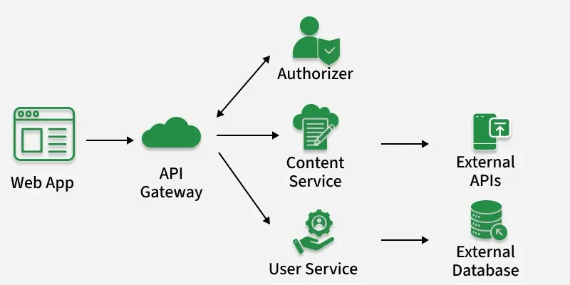

Serverless Architecture (সার্ভারলেস আর্কিটেকচার / FaaS)

### বিস্তারিত (Overview)
সার্ভারলেস মানে "সার্ভার নেই" তা নয়; এর অর্থ হলো আপনাকে কোনো সার্ভার বা ভিএম ওএস মেইনটেইন, প্যাচিং বা স্কেলিং করতে হবে না। ক্লাউড প্রোভাইডার সম্পূর্ণ ব্যাকএন্ড অবকাঠামো হ্যান্ডেল করে। ডেভেলপার শুধু কোড/ফাংশন লেখে (Function-as-a-Service - FaaS) এবং কোনো ইভেন্ট (যেমন: HTTP Request বা File Upload) হিট করলে সেটি এক্সিকিউট হয় (যেমন: AWS Lambda, Google Cloud Functions)।

+---------------+     HTTP Trigger     +-------------------------+
| Client / User | -------------------> | AWS Lambda Function     |
+---------------+                      | (Executes Code & Dies)  |

|
v

| DynamoDB / S3           |

### কেন ব্যবহার করবেন? (Why Use It)
* ১-টু-১ সার্ভার ম্যানেজমেন্ট এড়াতে এবং **Pay-as-you-go** (যতটুক কোড চলবে ঠিক ততটুকের জন্য বিল) মডেল ব্যবহারের জন্য।

### কখন ব্যবহার করবেন? (When to Use It)
* ইভেন্ট-ড্রিভেন টাস্ক, ইমেজ/ফাইল প্রসেসিং ব্যাকগ্রাউন্ড জব, বট বা যেসব অ্যাপে একটানা ট্রাফিক থাকে না (অনিশ্চিত বা হঠাৎ স্পাইক করে এমন ট্রাফিক)।

### সুবিধা (Pros)
* **শূন্য সার্ভার ম্যানেজমেন্ট:** নো ওএস প্যাচিং, নো প্রোভিশনিং।
* **ইনফিনিট অটো-স্কেলিং:** ১টি রিকোয়েস্ট বা ১০ লাখ রিকোয়েস্ট—সব ক্লাউড নিজে হ্যান্ডেল করে।
* **কস্ট এফিসিয়েন্ট:** আইডল (Idle) টাইমে কোনো বিল দিতে হয় না।

### অসুবিধা (Cons)
* **কোল্ড স্টার্ট (Cold Start):** অনেকক্ষণ পর কোনো ফাংশন প্রথমবার কল হলে সার্ভিস চালু হতে সামান্য নেটওয়ার্ক ল্যাটেন্সি (Delay) দেখা যায়।
* **ভেন্ডর লক-ইন (Vendor Lock-in):** AWS Lambda-র কোড কনফিগারেশন সরাসরি Google Cloud-এ ট্রান্সফার করা কঠিন।
* **লং-রানিং টাস্কের সীমাবদ্ধতা:** দীর্ঘ সময় ধরে চলা জবের জন্য এটা উপযুক্ত নয় (নির্দিষ্ট সময়সীমা থাকে, যেমন ১৫ মিনিট)।

---

