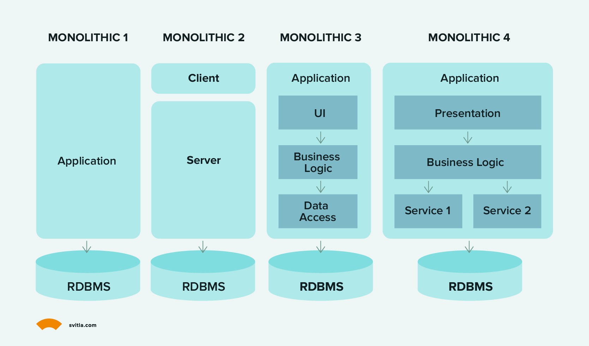

+---------------------------------------------------+
|               MONOLITHIC APPLICATION             |
|  +------------------+ +-------------------------+  |
|  | User Management  | |   Order Processing      |  |
|  +------------------+ +-------------------------+  |
|  | Payment Gateway  | | Notification Service    |  |
|  +------------------+ +-------------------------+  |
+---------------------------------------------------+
|
v
+------------------+
| Single Database  |
+------------------+

### কেন ব্যবহার করবেন? (Why Use It)
* শুরুতে প্রজেক্টের জটিলতা (Operational Complexity) কমানোর জন্য।
* ছোট টিম এবং দ্রুত প্রোডাক্ট মার্কেট ভ্যালিডেশনের (MVP - Minimum Viability Product) জন্য।

### কখন ব্যবহার করবেন? (When to Use It)
* প্রজেক্টের শুরুর দিকে (Early Stage / MVP)।
* টিম সাইজ ছোট হলে (১-১০ জন ডেভেলপার)।
* বিজনেসের ডোমেইন এবং ফিউচার স্কেলিং রিকোয়ারমেন্ট যখন পরিষ্কার নয়।

### সুবিধা (Pros)
* **সহজ ডিপ্লয়মেন্ট (Simple Deployment):** একটি মাত্র এক্সিকিউটেবল ফাইল বা ড্যাকার ইমেজ ডিপ্লয় করতে হয়।
* **সহজ টেস্টিং ও ডিব্যাগিং:** পুরো কোডবেস এক জায়গায় থাকায় এন্ড-টু-এন্ড টেস্টিং এবং লোকাল ডিব্যাগিং খুব সহজ।
* **হাই পারফরম্যান্স (Low Latency):** ইন-মেমোরি ফাংশন কলের মাধ্যমে মডিউলগুলো কথা বলে, কোনো নেটওয়ার্ক কল (Network Latency) লাগে না।

### অসুবিধা (Cons)
* **টাইটলি কাপল্ড (Tight Coupling):** একটি মডিউলে পরিবর্তন আনলে পুরো অ্যাপ্লিকেশন রিকম্পাইল ও রেডিপ্লয় করতে হয়।
* **স্কেলেবিলিটি সীমা (Scalability Bottleneck):** কোনো নির্দিষ্ট ফিচার বেশি ট্রাফিক পেলে পুরো মনোলিথকেই স্কেল (Vertical/Horizontal) করতে হয়।
* **সিঙ্গেল পয়েন্ট অব ফেইলিয়ার (Single Point of Failure):** কোডের একটি মডিউলে বাগ বা মেমোরি লিক থাকলে পুরো অ্যাপ্লিকেশন ক্র্যাশ করতে পারে।

---

